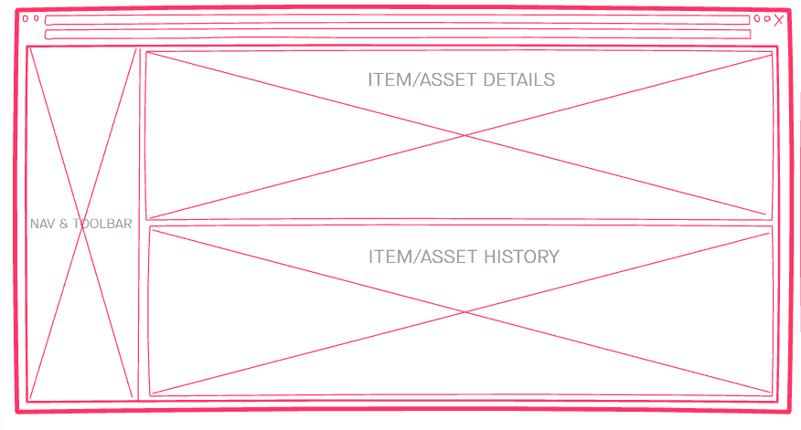
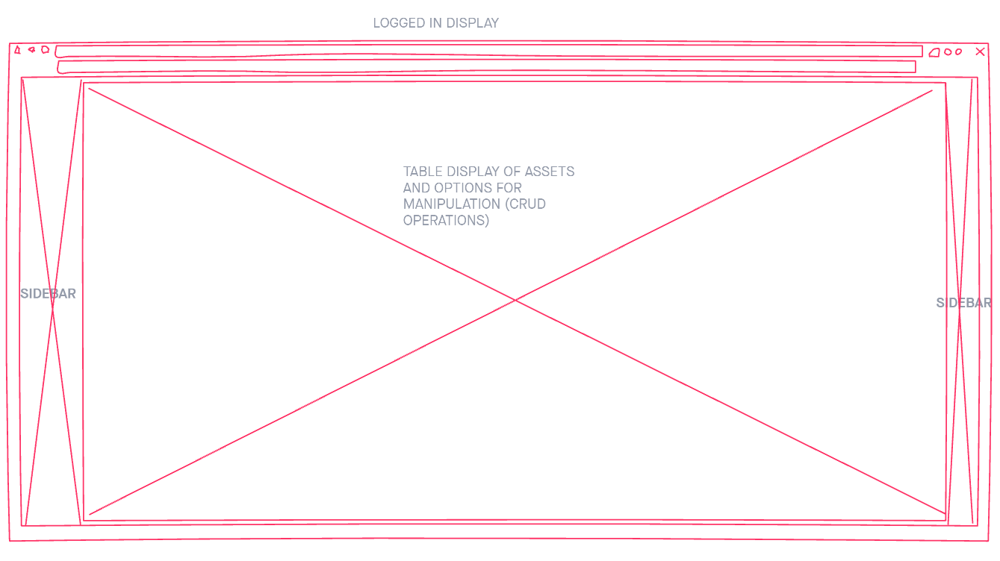
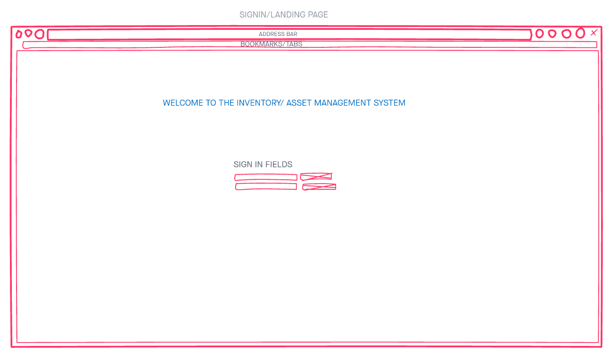
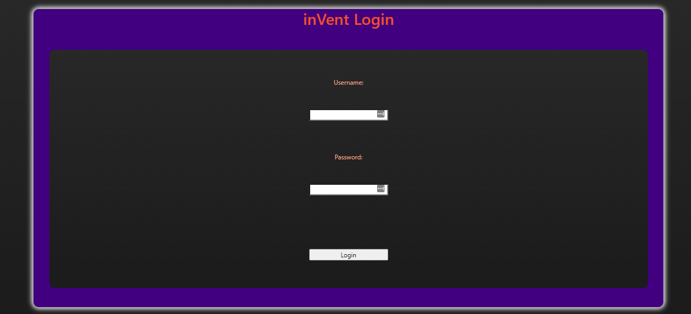
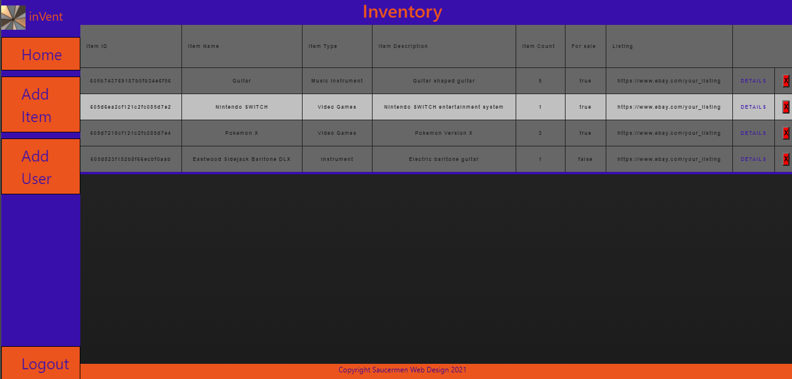
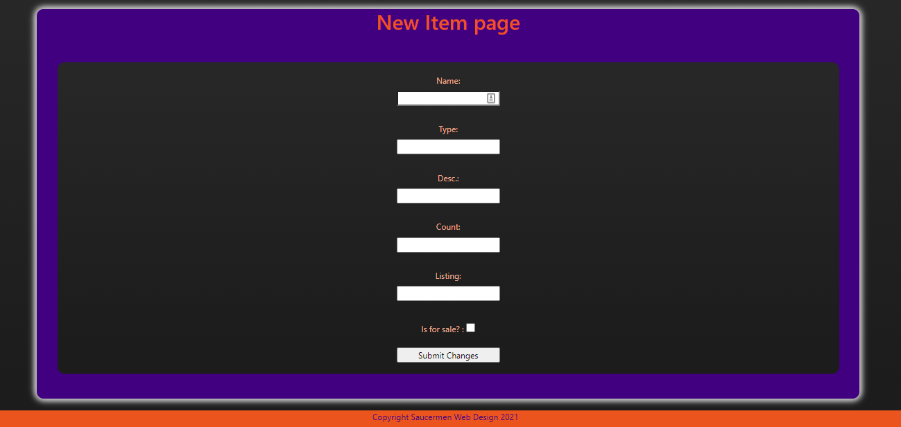
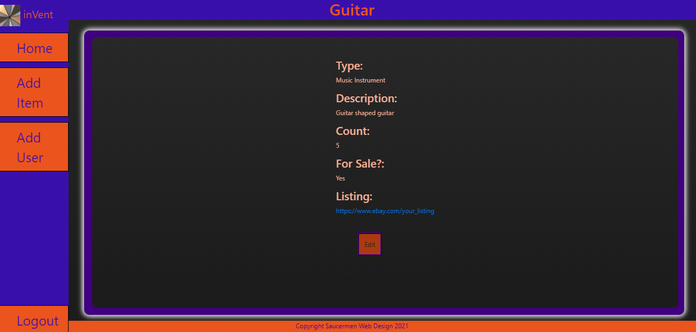
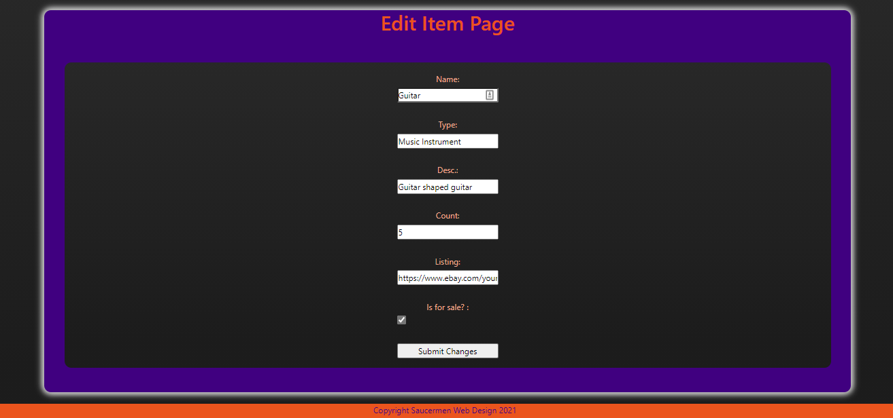

# inVent - Inventory/Asset Manager

inVent empowers small private sellers by helping them manage their inventory like the pros

## Technologies/Dependencies

* JS/jQuery
* HTML
* CSS
* mySQL
* NodeJS
* Express
* Morgan (development logging)
* Nodemon
* dotenv
* ejs
* method-override
* mySQL
* bcrypt
* express-session
* path
* serve-favicon

## Getting Started

* Browse to the landing page and log-in, or create a new user.
  * Upon logging in you will be brought to the inventory display.

## Wireframes

### Single Item View Wireframe

### All Items/Assets View Wireframe

### Login View Wireframe

## Screenshots

### Login

### Inventory List

### Add Item

### View Item

### Edit Item

## Features

    * Add & delete items (either inventory unit, or asset), to/from a table.
    * Designate the item type (i.e. Electronics, Grocery, Clothing, etc.).
    * Designate count of items and if for sale (inventory), or not (asset).
    * Display a single item and its activity log when clicked from the main table display.
    * Edit item properties from single item display.
    * Add link for items listed online
    * User creation and authentication 

## User Stories

    * Implement basic authorization by restricting access to certain features, such as editing and deleting a resource, to an authenticated user, or the user that created that resource.
    * AAU I would like to be able to pull asset/inventory details from a pre-populated list, so I do not have to look up specifications elsewhere.
    * AAU I would like to be able to be able to access the data from my assets list from separate applications, or locations outside of inVent, because this information is pertinent for reporting, finances, etc.
    * AAU I would like to be able to filter my assets by different their different properties, because I need to be able to display all of a certain type, all listed on a certain day, etc...

## Stretch Goals/Future Goal

    * Export asset list as json (Serve own API), or spreadsheet
    * User roles
    * Set and manage accounts and roles for organization from admin console
    * Select items will pre-populate description with specifications using data from a third-party API  
    * Filtering!
    * Item conditions
